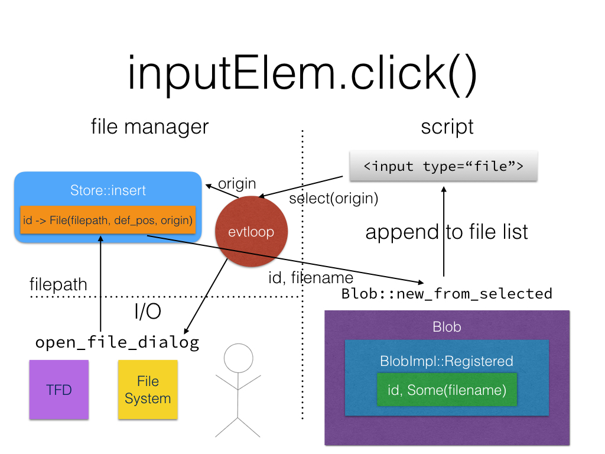
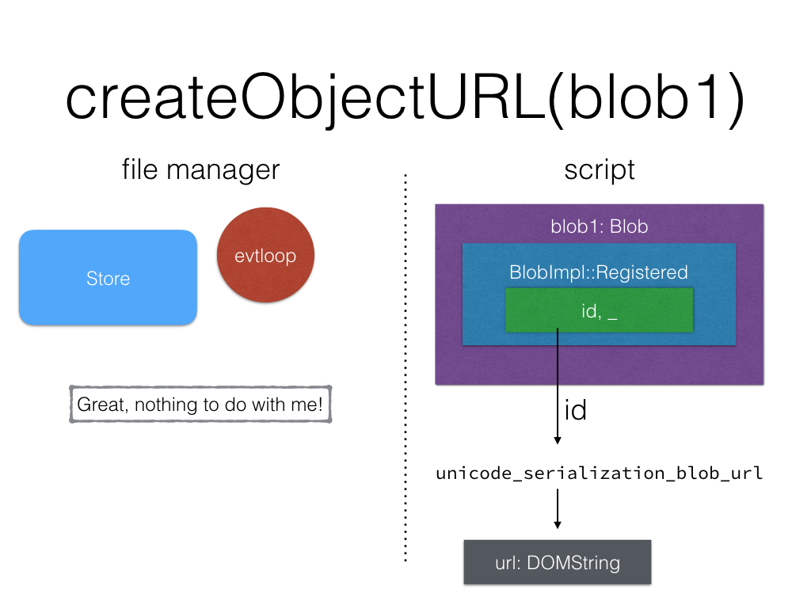

# Midterm Summary (Draft)

## Current Status

### File Manager
File manager thread will be spawned by `net` process and is mainly responsible for file ID registration. The file-picking request will also be routed to it and it will only return the filename and file id, for security considerations.

### DOM API
The API of `Blob` and `File` are much enhanced, esp. by the introduction of file-based backend. Se `BlobImpl` for further information on this.

For support of Blob URL, the `URL` DOM object's two methods are implemented: `createObjectURL` and `revokeObjectURL`.

For all the APIs described above, it needs to communicate with file manager thread and *delegate* some real work to it if necessary.

### Input element
The `htmlinputelement` is enhanced in several ways regarding `<input type="file">`, esp. the implementation of activation behaviour. It will get file name etc. from file manager thread, create a `File` and add it to the `FileList` attached to the element.

### File-picking
Currently, we used `tinyfiledialogs-rs` to support file picking dialog UI. Note that it doesn't support Windows and `open_file_dialog` will defaults to `None` which will be interpreted as `UserCancelled`.

I also ported the [native-file-dialog](https://github.com/izgzhen/libnfd) to Rust, but it is less general than TFD. Also, TFD might be replaced by a more unified approach like [libui](https://github.com/andlabs/libui) in the future.

## Current Issues

> ordered by priority.

1. `createObjectURL` on a sliced Blob
    - **Issue**: Now, the `Blob` will be read according to the slice position and a new, concrete, and *immutable* copy will be moved to file manager thread and a UUID registered with it will be returned. However, `slice` is a reference semantics, UUID is a reference semantics as well. So even if you layer them together, you should still get a reference back, rather than a copy.
    - **How to fix**: Maintain the slice positions in file manager thread
    - **NOTE**: `uuid(slice(sth))` != `slice(uuid(sth))`. Well, uuid is like a pointer, while slice is like a pair of offsets plus a *thing* (pointer or array, who knows).
2. `createObjectURL` on a file-based Blob
    - **Issue**: We can't get the filename info out, even if the Blob is file-backed. The filename will be used in the header of response to Blob URL request.
    - **How to fix**: Cache the filename inside Blob DOM object
6. The `Blob` URL loading
    - **Issue**: Still not forwarding `blob:<URL>` resource loading in `script` to file manager thread yet. It is still too early to do.
    - **How to fix**: Do if when you are ready
4. Stream-based reading
    - **Issue**: Say you call `fileReader.readAsText`, in the `FileReader::read`, `Blob::read_file` will be invoked if the Blob is a file-based one, and in that function, the script thread (either async or sync w.r.t main thread) will wait on the file manager until it returns the *whole file content* buffered in a `vec<u8>` inside message. While at the same time, the file manager will also buffer the whole content during reading it from file system before sending a bit of it. This can be slow, esp. if the blob is actually slice, which might let us to exploit this and do a partial reading
    - **How to fix**: There should be something implementing `Read` and send a chunk at a time by coordinating `Blob` and file manager implementation
2. `Blob.Close()`: Delete the entry if it is registered in store. Too early to do now.
5. UI: implement the `<input type="file">` widget. Progressing it in parallel should be fine.

## Future Issues (not investigated yet)
* Interaction with XHR
* Interaction with form submission

## Blocked Issues
1. `Origin`
2. `ArrayBuffer`

## Design

